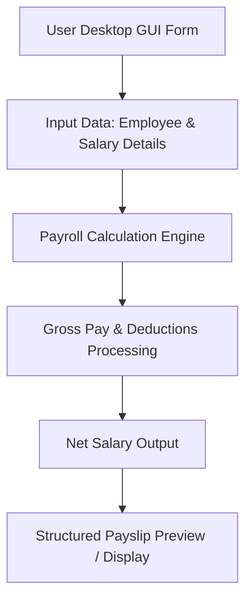

# Tkinter Payslip Generator 💼

A desktop-based GUI application built with Python and Tkinter for generating, calculating, and structuring employee payslips with clear earnings and deductions breakdowns.

---

## ✨ Features
* **Interactive Desktop GUI:** Clean and intuitive graphical user interface built with native Tkinter components.
* **Automated Salary Calculations:** Computes gross pay, allowances, standard deductions (tax, PF, etc.), and final net salary.
* **Structured Payslip Generation:** Formats employee payment details into a clean, readable payslip layout.
* **Input Validation & Reset:** Handles user input safely with clear and reset capabilities for generating multiple records.

---

## 🛠️ Tech Stack
* **Language:** Python 3.8+
* **GUI Framework:** Tkinter (Python Standard GUI Library)
* **Application Type:** Desktop Utility

---

## 🚀 Quick Start

1. **Clone the Repository**
   ```bash
   git clone [https://github.com/satyanarayana51115/tk_payslip_project.git](https://github.com/satyanarayana51115/tk_payslip_project.git)
   cd tk_payslip_project
   ```

2. **Run the Application**
   *(Runs directly using the Python standard library - no external pip packages required)*
   ```bash
   python main.py
   ```

3. **Generate Payslip**
   Enter employee details, basic salary, allowances, and deductions in the form fields, then click the calculate/generate button to view the structured payslip.

---

## 🔁 Application Workflow



---

## 👨‍💻 Author
**Satyanarayana** - [@satyanarayana51115](https://github.com/satyanarayana51115)
